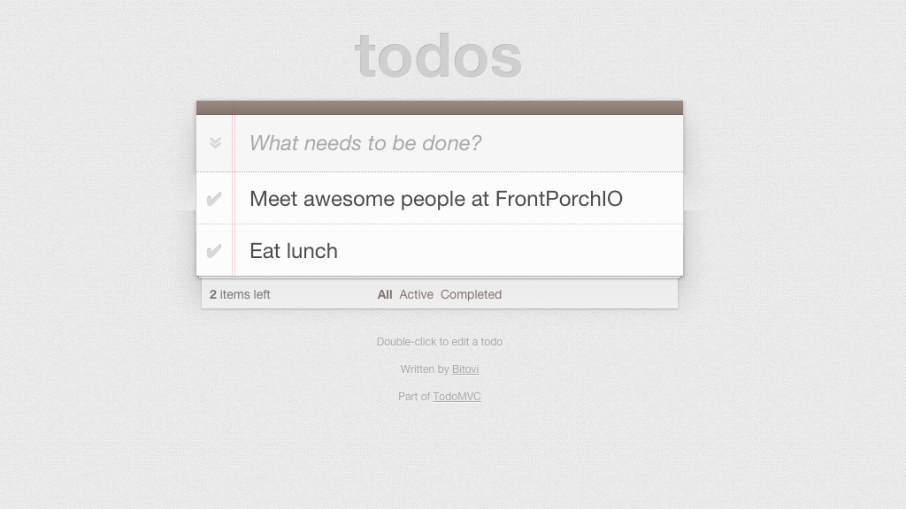
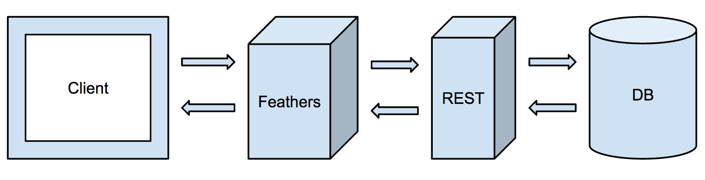

title: Realtime for Reals
author:
  name: Alexis Abril
  twitter: alexisabril
  url: featherjs.com
output: index.html
style: style.css
theme: sudodoki/reveal-cleaver-theme

--

# Realtime
## for reals!

--

--

<ul class="list">
  <li>
    
  </li>

  <li>
    
  </li>

  <li>
    
  </li>

  <li>
    
  </li>

  <li>
    
  </li>

</ul>

--

# @DallasJS

--

--

# What is FeathersJS?

--

### Service Objects

    var myService = {
      find: function(params, callback) {},
      get: function(id, params, callback) {},
      create: function(data, params, callback) {},
      update: function(id, data, params, callback) {},
      remove: function(id, params, callback) {}
    }

--

### A Simple Todo Service

--

### A Simple Todo Service

    var todoService = {
      find: function(params, callback) {
        /* var todos = DB call for todos */

        callback(null, todos);
      },

      create: function(data, params, callback) {
        /* var todo = DB call to create a todo */

        callback(null, todo);
      }
    };

--

### REST API Setup

    feathers()
      .configure(feathers.rest())
      .use('/todos', todoService)
      .listen(3000);

--

### REST & WebSocket API Setup

    feathers()
      .configure(feathers.rest())
      .configure(feathers.socketio())
      .use('/todos', todoService)
      .listen(3000);

--

# The Showdown

    
    vs
    

--

### theshowdown.herokuapp.com
#### To the Editor!

--

### Common REST Architecture

--

### Feathers in the Middle

--

